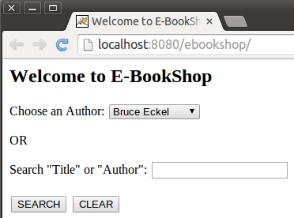
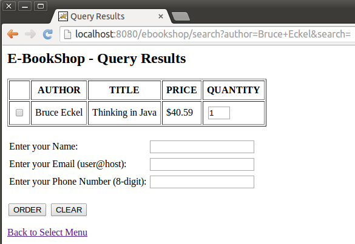
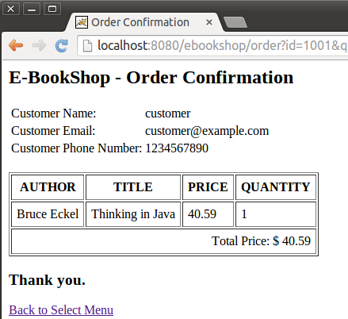

##E-BookShop

Developing a primitive functional online bookstore. It's a self project and I'm still working on it. 

##To Do

- Pooling DB connection

- Session management

- User and Role management

---

##Current status
- Browsing and search

- Query result

- Order confirmation

##Files in this repo

I upload the project folder to github directly. To run this project, corresponding databases is necessary. Please refer to `web.xml` to get more configuration information. 

To help you import this project easily, I also upload a `.zip` file to this repo.